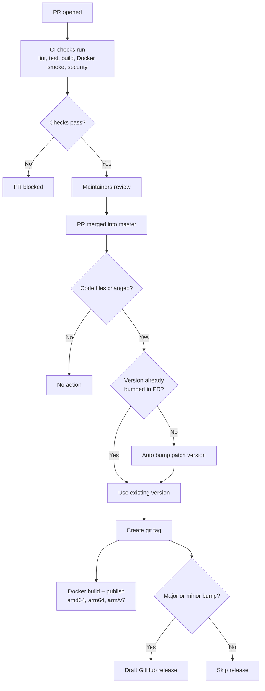

# Releases and Workflows

- [Release Schedule](#release-schedule)
- [Deployment Process](#deployment-process)
- [Git Strategy](#git-strategy)
- [Automated Workflows](#automated-workflows)
- [Release Pipeline](#release-pipeline)

## Release Schedule

We're using [Semantic Versioning](https://semver.org/), to indicate major, minor and patch versions. You can find the current version number in the readme, and check your apps version under the config menu. The version number is pulled from the [package.json](https://github.com/Lissy93/dashy/blob/master/package.json#L3) file.

Typically there is a new major release every 2 weeks, usually on Sunday, and you can view these under the [Releases Page](https://github.com/Lissy93/dashy/releases). Each new version will also have a corresponding [tag on GitHub](https://github.com/Lissy93/dashy/tags), and each major release will also result in the creation of a new [tag on DockerHub](https://hub.docker.com/r/lissy93/dashy/tags), so that you can fix your container to a certain version.

For a full breakdown of each change, you can view the [Changelog](https://github.com/Lissy93/dashy/blob/master/.github/CHANGELOG.md). Each new feature or significant change needs to be submitted through a pull request, which makes it easy to review and track these changes, and roll back if needed.

---

## Deployment Process

All changes and new features are submitted as pull requests, which can then be tested, reviewed and (hopefully) merged into the master branch. Every time there is a change in the major version number, a new release is published. This usually happens every 2 weeks, on a Sunday.

When a PR is opened:

- A series of CI checks run against the new code (lint, test, build, Docker smoke test, security audit). The PR cannot be merged if any required check fails
- If `yarn.lock` was modified, Liss-Bot adds a comment summarising which packages changed

After the PR is merged into master:

- If code files changed and the version in package.json wasn't already bumped, the patch version is auto-incremented and committed ([bump-and-tag.yml](https://github.com/Lissy93/dashy/blob/master/.github/workflows/bump-and-tag.yml))
- A git tag is created and pushed for the new version
- The tag push triggers Docker image builds for `linux/amd64`, `linux/arm64` and `linux/arm/v7`, published to both DockerHub and GHCR ([docker-build-publish.yml](https://github.com/Lissy93/dashy/blob/master/.github/workflows/docker-build-publish.yml))
- If the tag is a major or minor version bump, a draft GitHub release is created with auto-generated release notes ([draft-release.yml](https://github.com/Lissy93/dashy/blob/master/.github/workflows/draft-release.yml)). Patch-only bumps skip the release

Manual tagging is also available via the [manual-tag.yml](https://github.com/Lissy93/dashy/blob/master/.github/workflows/manual-tag.yml) workflow. You can either provide a specific version (e.g. `3.2.0`) or leave it empty to auto-bump the patch version. This is useful if the automated flow didn't trigger or you need to cut a release outside the normal PR flow.

---

## Git Strategy

### Git Flow

Like most Git repos, we are following the [Github Flow](https://guides.github.com/introduction/flow) standard.

1. Create a branch (or fork if you don'd have write access)
2. Code some awesome stuff, then add and commit your changes
3. Create a Pull Request, complete the checklist and ensure the build succeeds
4. Follow up with any reviews on your code
5. Merge 🎉

### Git Branch Naming

The format of your branch name should be something similar to: `[TYPE]/[TICKET]_[TITLE]`
For example, `FEATURE/420_Awesome-feature` or `FIX/690_login-server-error`

### Commit Emojis

Using a single emoji at the start of each commit message, to indicate the type task, makes the commit ledger easier to understand, plus it looks cool.

- 🎨 `:art:` - Improve structure / format of the code.
- ⚡️ `:zap:` - Improve performance.
- 🔥 `:fire:` - Remove code or files.
- 🐛 `:bug:` - Fix a bug.
- 🚑️ `:ambulance:` - Critical hotfix
- ✨ `:sparkles:` - Introduce new features.
- 📝 `:memo:` - Add or update documentation.
- 🚀 `:rocket:` - Deploy stuff.
- 💄 `:lipstick:` - Add or update the UI and style files.
- 🎉 `:tada:` - Begin a project.
- ✅ `:white_check_mark:` - Add, update, or pass tests.
- 🔒️ `:lock:` - Fix security issues.
- 🔖 `:bookmark:` - Make a Release or Version tag.
- 🚨 `:rotating_light:` - Fix compiler / linter warnings.
- 🚧 `:construction:` - Work in progress.
- ⬆️ `:arrow_up:` - Upgrade dependencies.
- 👷 `:construction_worker:` - Add or update CI build system.
- ♻️ `:recycle:` - Refactor code.
- 🩹 `:adhesive_bandage:` - Simple fix for a non-critical issue.
- 🔧 `:wrench:` - Add or update configuration files.
- 🍱 `:bento:` - Add or update assets.
- 🗃️ `:card_file_box:` - Perform database schema related changes.
- ✏️ `:pencil2:` - Fix typos.
- 🌐 `:globe_with_meridians:` - Internationalization and translations.

For a full list of options, see [gitmoji.dev](https://gitmoji.dev/)

### PR Guidelines

Once you've made your changes, and pushed them to your fork or branch, you're ready to open a pull request!

For a pull request to be merged, it must:

- Must be backwards compatible
- The build, lint and tests (run by GH actions) must pass
- There must not be any merge conflicts

When you submit your PR, include the required info, by filling out the PR template. Including:

- A brief description of your changes
- The issue, ticket or discussion number (if applicable)
- For UI relate updates include a screenshot
- If any dependencies were added, explain why it was needed, state the cost associated, and confirm it does not introduce any security issues
- Finally, check the checkboxes, to confirm that the standards are met, and hit submit!

---

## Automated Workflows

Dashy makes heavy use of [GitHub Actions](https://github.com/features/actions) to fully automate the checking, testing, building, deploying of the project, as well as administration tasks like management of issues, tags, releases and documentation. The following section outlines each workflow, along with a link the the action file, current status and short description. A lot of these automations were made possible using community actions contributed to GH marketplace by some amazing people.

### CI Checks

These run on every pull request targeting master. All required checks must pass before merging.

Action | Description
--- | ---
**PR Quality Check**   | Runs lint, unit tests, a full build and Docker smoke test against every PR. Also runs a security audit on dependencies
**Dependency Update Summary**   | When yarn.lock is modified in a PR, Liss-Bot comments with a summary of which packages changed

### Releases

Action | Description
--- | ---
**Auto Version & Tag**   | When a PR with code changes is merged into master, auto-bumps the patch version (if not already bumped) and creates a git tag
**Manual Tag**   | Manual dispatch workflow. Provide a version to tag, or leave empty to auto-bump patch. Updates package.json, commits and creates the tag
**Docker Publish**   | Triggered by tag pushes. Builds multi-arch Docker images and publishes to DockerHub and GHCR with semver tags
**Draft Release**   | Triggered by tag pushes. Creates a draft GitHub release with auto-generated notes for major or minor version bumps. Patch-only bumps are skipped

### Issue Management

Action | Description
--- | ---
**Close Stale Issues**   | Issues which have not been updated for a long time will have a comment posted to them. If the author does not reply, the issue will be marked as stale and closed. Also handles issues awaiting user response and pings the maintainer when needed

### Documentation

Action | Description
--- | ---
**Wiki Sync**   | Publishes the repository wiki from the markdown files in the docs directory. Runs weekly and on manual dispatch
**Update Docs Site**   | When docs change on master, copies them to the website branch and processes them for the docs site
**Build Docs Site**   | Builds and deploys the documentation website from the WEBSITE/docs-site-source branch

### Other

Action | Description
--- | ---
**Mirror to Codeberg**   | Pushes a copy of the repo to Codeberg weekly and on manual dispatch

---

## Release Pipeline

---
